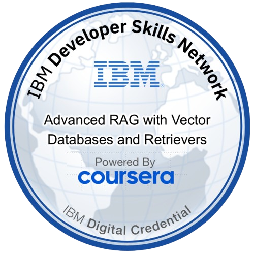
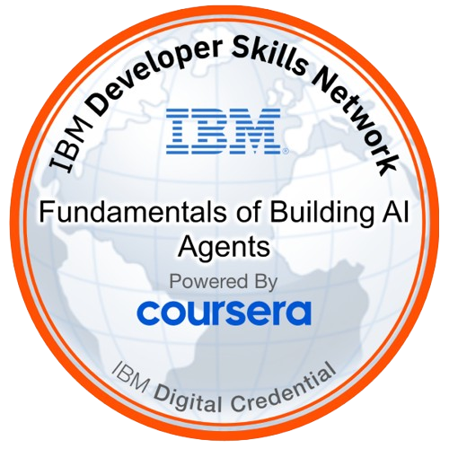

<div align="center">


</div>

<br/>

[](https://www.linkedin.com/in/karanpreet-5ingh)

<br/>

<div align="center">

</div>

---

## Currently Building

```
cli-rag-app/          →  Command-line RAG for intelligent retrieval
agentic-ai-lab/       →  Autonomous agents & tool-using AI systems
```

## Upcoming

```
rag-insider-risk/         →  RAG pipeline for insider risk intelligence
model-health-dashboard/   →  AI model drift & reliability monitoring
```

---

## Tech Stack

<div align="center">

<br/>

<table>
  <tr>
    <td align="center" width="90">
      <br/>Python
    </td>
    <td align="center" width="90">
      <br/>C++
    </td>
    <td align="center" width="90">
      <br/>AWS
    </td>
    <td align="center" width="90">
      <br/>Docker
    </td>
    <td align="center" width="90">
      <br/>Kubernetes
    </td>
    <td align="center" width="90">
      <br/>GitHub
    </td>
    <td align="center" width="90">
      <br/>SQL
    </td>
  </tr>
  <tr>
    <td align="center" width="90">
      <br/>PyTorch
    </td>
    <td align="center" width="90">
      <br/>TensorFlow
    </td>
    <td align="center" width="90">
      <br/>OpenCV
    </td>
    <td align="center" width="90">
      <br/>FastAPI
    </td>
    <td align="center" width="90">
      <br/>Flask
    </td>
    <td align="center" width="90">
      <br/>Django
    </td>
    <td align="center" width="90">
      <br/>GCP
    </td>
  </tr>
  <tr>
    <td align="center" width="90">
      <br/>Linux
    </td>
    <td align="center" width="90">
      <br/>Git
    </td>
    <td align="center" width="90">
      <br/>Grafana
    </td>
    <td align="center" width="90">
      <br/>Prometheus
    </td>
    <td align="center" width="90">
      <br/>Jenkins
    </td>
    <td align="center" width="90">
      <br/>Arduino
    </td>
    <td align="center" width="90">
      <br/>Android
    </td>
  </tr>
</table>

<br/>

**RAG & Vector Intelligence**


<br/>

</div>

---

## Activity

<div align="center">


</div>

<br/>

<div align="center">

</div>

---

## Research & Certifications

<div align="center">

[](https://scholar.google.com/citations?user=gmjWDxkAAAAJ&hl=en)

<br/><br/>

<table border="0" cellspacing="0" cellpadding="20">
  <tr>
    <td align="center">
      <a href="https://www.credly.com/badges/487b8d6c-4a04-4049-be2f-515f4e570f15" target="_blank">
        
      </a>
      <br/><br/>
      <sub><b>Advanced RAG with Vector Databases</b></sub><br/>
      <sub>Coursera &nbsp;·&nbsp; Verified on Credly</sub>
    </td>
    <td width="60"></td>
    <td align="center">
      <a href="https://www.credly.com/badges/ca8d463b-5766-4baf-bf06-1a0d8bf58a12/public_url" target="_blank">
        
      </a>
      <br/><br/>
      <sub><b>Fundamentals of Building AI Agents</b></sub><br/>
      <sub>Coursera &nbsp;·&nbsp; Verified on Credly</sub>
    </td>
  </tr>
</table>

<br/>

</div>

---

## 2026 Vision

```
▸  Engineering   →  Build production-grade AI systems at scale
▸  Research      →  Publish impactful applied AI work
▸  Frontier      →  AI × Security × Edge Intelligence
▸  Web3          →  Deep dive into Bitcoin infra & decentralized systems
```

---

<div align="center">

</div>

<br/>

<div align="center">

</div>

<br/>

